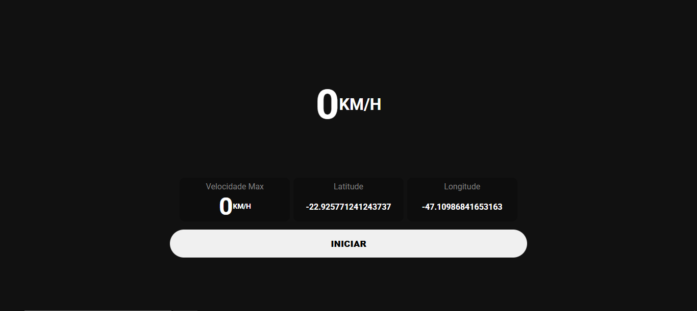

<section>
  <h1>📱 Velocímetro Digital</h1>
  

    Este projeto é um velocímetro digital desenvolvido com foco em aplicações web/mobile que utilizam a API de Geolocalização do navegador para captar a localização do usuário em tempo real      e calcular sua velocidade com base no deslocamento. A velocidade é exibida em km/h e atualizada dinamicamente conforme o usuário se movimenta. Ideal para uso em atividades ao ar livre,       como caminhadas, corridas ou ciclismo. Acesse <a href="https://fellypesouza.github.io/Velocimetro-Digital/" target="_blank">aqui</a>.
  

  <h1>⚙️ Tecnologias utilizadas</h1>
  <ul>
    <li>Angular</li>
    <li>Typescript</li>
    <li>GeoLocation API</li>
  </ul>
  <h1>🚀 Funcionalidades</h1>
  <ul>
    <li>Captura contínua da localização com watchPosition</li>
    <li>Conversão automática da velocidade de m/s para km/h</li>
    <li>Interface simples e responsiva</li>
  </ul>
  
</section>
